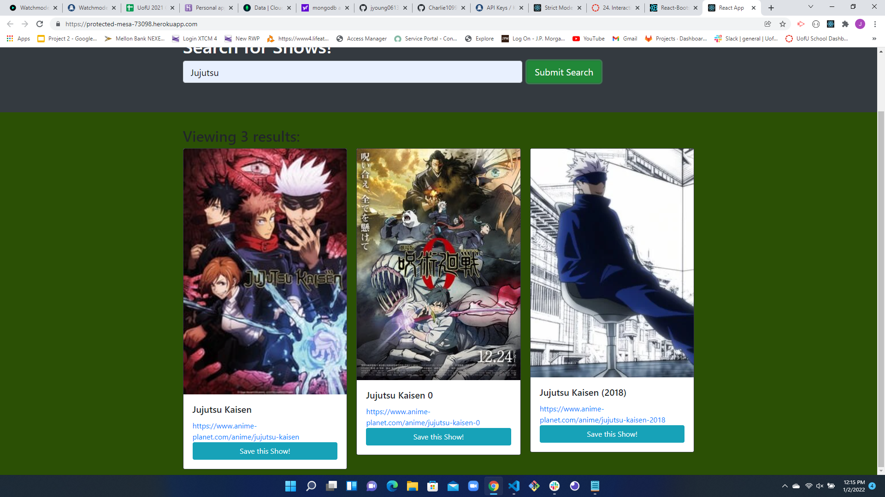

## Project-3
A performant and scalable MERN stack single-page application that fulfills a real-world need, with a focus on data and user demand.

## Table of Contents
  - [Deployment](#Deployment)
  - [Description](#Description)
  - [Contributing](#Contributing)
  - [Technologies](#Technologies)
  - [License](#License)
  - [Questions](#Questions)

## Deployment

# [AnimeSearch_Live_Site](https://protected-mesa-73098.herokuapp.com/)

## Description
A scalable MERN stack single-page applicatioin that is an Anime Search site allowing users to search all of their favorite anime, save the shows they like and provides links for the end user to go to for viewing.

## Contributing
# John Young - GitHub: [jyoung0613](https://github.com/jyoung0613). - Back-End
# Cameron CharlesWorth - GitHub: [charlie1099](https://github.com/Charlie1099). - Back-End
# Tyler Allison - GitHub: [TWAllison](https://github.com/TWAllison). - Front-End
# Kayla Worth - GitHub: [kworth999](https://github.com/kworth999). - Front-End

## Technologies Used

- [GitHub - My site] (<https://github.com/jyoung0613/Project-3>)
- JavaScript
- Node
- Mongo
- [MongoDB Atlas] (<https://www.mongodb.com/cloud/atlas>)
- React
- Express
- GraphQL
- Apollo Server

## License
  This project is licensed under the terms of the following license: **MIT**.

## Questions
  GitHub: [jyoung0613](https://github.com/jyoung0613).  

  For inquiries, please contact jwyoung0613@gmail.com.  :slightly_smiling_face: